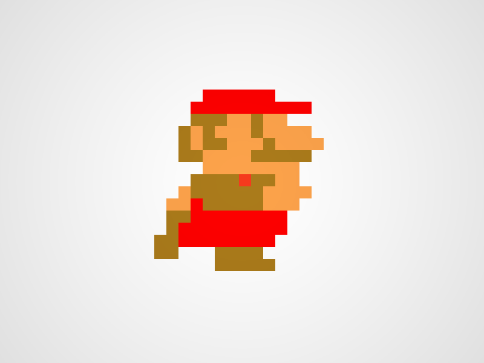
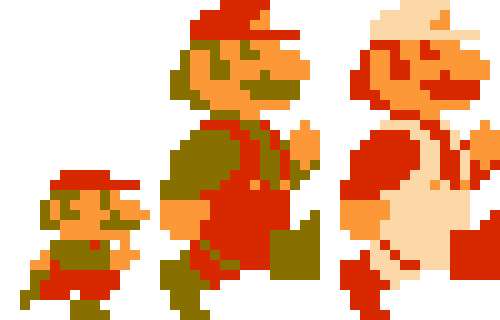

# Sản phẩm: Game 2d màn hình ngang
# Giới thiệu
- Dự án nhằm tạo ra một tựa game 2D bắn súng màn hình ngang, lối chơi Hit and Run có sự tương đồng như game Contra và Metal Slug
# Mục tiêu
-Tạo ra 1 tựa game có dung lượng nhẹ, mang tính giải trí và không yêu cầu cao về mặt kĩ năng cũng như yêu cầu về hệ thống 
# Game được làm như thế nào
- Game được làm bằng engine [Unity](https://unity.com/), lập trình bằng ngôn ngữ C# và phần nhỏ các ngôn ngữ khác 
# Cơ sở dữ liệu
# Phân công công việc

    Đây là một bảng phân công công việc cho dự án Game 2D Cơ Bản.

| Công Việc                   | Người Thực Hiện  | Trạng Thái | Thời Hạn   |
|:-----------------------------------|------------------|:------------:|------------|
| Xây dựng hệ thống bản đồ    | 🤡All       | ❌        | 15/10/2023 |
| Lập trình nhân vật, spam quái          | 🤡All          | ❌        | 22/10/2023 |
| Tạo hình ảnh và âm thanh  | 🤡All     | ❌        | 30/10/2023 |
| Xử lý logic           | 🤡All          | ❌        | 03/11/2023 |
| Kiểm tra và sửa lỗi       | 🤡All           | ❌        | 7/11/2023 |
| Kiểm tra và phát hành       | 🤡All           | ❌        | 14/11/2023 

$\to$ Chú thích:
```c
   Cột Trạng Thái biểu tượng hoàn thành (✅) hoặc không hoàn thành (❌) của công việc được giao.
```

# Xây dựng nhân vật mario và demo nhân vật chuyển động khi mario nhỏ, mario lớn và mario chuyển trạng thái khi ăn hoa


# Thành viên    
- 😺**Quang**
- 🤡**Thăng** 
- 😘**Nhân**

## Hướng dẫn tải về

```bash
git clone https://github.com/B4ch0-Production/Game2D.git
cd projects
```
## Kế hoạch trong tương lai
 Nhờ vào sự đóng góp của bạn!
 Chia sẻ với chúng tôi ý kiến của bạn để giúp hoàn thiện hơn ❤️❤️❤️❤️


